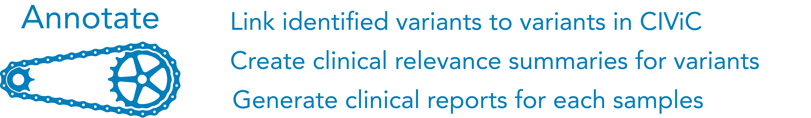

=================
Annotate variants
=================

After identifying a putative list of somatic variants associated with the patient's tumor, this section describes how to link variants back to the CIViC database to annotate the sample/variants for clinical relevance. We again use an interactive interface (jupyter notebook) to import somatic variants calls and output a report that can be easily consumed by the user. 

>>>>>>>>>>>>>>>>>>>>>>>>>>>
Build Binder Docker Image
>>>>>>>>>>>>>>>>>>>>>>>>>>>

We have built a `Binder Jupyter Notebook <https://www.simula.no/file/projectjupyterpdf/download>`_ that contains code to pull in a BED/BED-like file and link variants to clinical relevance annotations for all variants that have CIViC curation. Please open the link provided below to start this process (Note: loading the Jupyter Notebook can take 5-10 minutes):

`Build Jupyter Notebook <https://mybinder.org/v2/gh/griffithlab/civic-panel/master?filepath=%2Fbinder_interactive%2FAnnotate_Variants>`_

>>>>>>>>>>>>>>>>>>>
Docker Image Set-up
>>>>>>>>>>>>>>>>>>>

Once the Jupiter Notebook is loaded, the interface should look as follows:

.. image:: images/Annotate_Variants_docker.png

**Annotate Variants Notebook.ipynb** = This notebook is an interactive session that allows users to run python scripts. The specific notebook in this section is set up to run Identified_variants_to_annotation.py. To use this notebook, you must change the input variables (input variant list) 

**Identified_variants_to_annotation.py** = Python script that takes in the somatic variant list (see test_annotate_variants.tsv) and the sample name. The script will iterate through each variant and ascertain if the variant is in CIViC. If a somatic variant is in CIViC, the script will pull all information about the variant (variant descriptions, assertions, and evidence items) and create an OpenCAP output report. After running the script, the output report will be created in the same directory as these files.

**test_annotate_variants.tsv** = BED-like tab-separated file with variant coordinates that require OpenCAP annotation. The file contains five columns: Chromosome, Start, Stop, Ref, Var. Each row provides genomic coordinates to a single somatic variant that was observed during sequencing. Each variant will be evaluated for presence in the CIViC database using OpenCAP.

>>>>>>>>>>>>>>>>>>>>>
Run OpenCAP in Binder
>>>>>>>>>>>>>>>>>>>>>

Using the Binder Docker Image created above, you can run the provided identified_variants_to_annotation.py script. This script will take in variants from the sequencing pipeline and output a document with annotation information.

Before running the Jupyter Notebook code blocks, you must upload your somatic variants to the home directory. This can be accomplished using the "upload" button on the home directory:

You must also change the sample name to match the sample name of the associated somatic variants. This name will be used to label the output files.

Once you have configured the input variables, you can run the command by holding the "shift" key and selecting "enter".

>>>>>>>>>>>>>>>>>>>>>
OpenCAP Output File
>>>>>>>>>>>>>>>>>>>>>

After you run Identified_variants_to_annotation.py using the Jupyter Notebook, a file will be generated in the home directory. This file name will start with the sample name and will end with `"OpenCAP_report.docx"`. Select this file to download the OpenCAP report for your sample. The report will look something like the following:

For a variant to be included in OpenCAP it must be a perfect match (i.e., chromosome, start, stop, reference, variant). Currently, OpenCAP does not support matching bucket variants (e.g., TP53 - MUTATION) or variants without specific genomic changes (e.g., KRAS - G12*). We hope to improve the pipeline over time to allow for annotation of these variants.

For somatic variants that have a perfect match with a CIViC entry, a "Clinical Variant" section has been created for this variant. For each entry, the annotation has four distinct parts:

1) **Variant Information:** For each variant, we list the following:

 - Gene name - `HUGO Nomenclature <https://www.genenames.org/>`_ 
 - Protein coding change  - `HGVS Nomenclature <http://varnomen.hgvs.org/>`_ for variant protein change
 - Genomic coordinates - `HGVS Nomenclature <http://varnomen.hgvs.org/>`_ for variant genomic coordinates 
 - ENST ID - `Ensembl transcript identification number <http://useast.ensembl.org/info/genome/genebuild/genome_annotation.html>`_ for representative transcript
 - ENSG ID - `Ensembl gene identification number <http://useast.ensembl.org/info/genome/genebuild/genome_annotation.html>`_ for gene

2) **Variant Description:** If the variant has a description in CIViC, the variant description has been reproduced in this section. The variant description contains a high-level overview of all evidence statements available for this variant.

3) **Associated Assertions:** If the variant has associated assertions, then these assertions have been reproduced in this section. Assertions incorporate multiple evidence items to support a single clinical relevance statement. Typically, assertions include information from nationally recognized organizations such as the NCCN, the FDA, and the AMP.

4) **Associated Evidence Items:** This section provides an overview of evidence items associated with the variant. Evidence items have been condensed into a grid with three columns. The first column is a single description of the evidence item, the second column provides the evidence item identification number(s) that support(s) the description, and finally, we provide the Pubmed identifications numbers associated with these evidence statements. For an evidence statement to be included in the grid, it must have an evidence level greater than "C" (Case Study) and it must be "Accepted".

