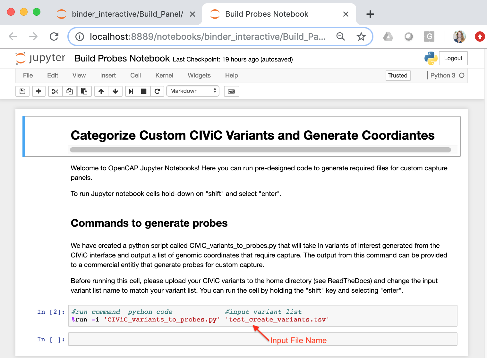

==========================
Build Custom Capture Panel
==========================

In this section we will use the CIViC interface to identify variants of interest for custom capture. The interface will then be used to download variants of interest, associated clinical descriptions, and curated coordinates. We will then open an interactive jupyter notebook to reformat the variant coordinates for probe development. The output from this exercise will be a file that is compatible with commercial probe development companies for custom panel development.

We have built a `Binder Jupyter Notebook <https://www.simula.no/file/projectjupyterpdf/download>`_ that contains code to pull in CIViC variants derived from the CIViC Search interface and create a list of genomic coordinates that require capture. While you are reading the tutorial, open the link provided below to start the process of loading a Binder Notebook (Note: loading the Jupyter Notebook can take 5-10 minutes):

`Build Jupyter Notebook <https://mybinder.org/v2/gh/griffithlab/civic-panel/master?filepath=%2Fbinder_interactive%2FBuild_Panel>`_

------------------------------
Identify variants for capture
------------------------------

The CIViC database is constantly being updated with new evidence statements and assertions. Therefore, we have provided a real-time query interface that allows users to build a pool of variants required for custom capture. This interface can be accessed by going to the CIViC website, selecting the “SEARCH” button, and navigating to the `Variants” tab: `SEARCH-Variants <https://civicdb.org/search/variants/>`_.

To identify variants for capture, users can add conditions (i.e., search criteria) based on 28 predetermined fields in the drop down menu. If multiple conditions are employed, the user has the option to take the union (i.e., match any of the following conditions) or the intersection (i.e., match all of the following conditions). Additionally, after conditions are employed, the user has the option to further filter the selected variants using column headers in the search grid. The user can filter on Gene Name, Variant Name, Variant Group(s), Variant Types(s), or Description. Once the user is satisfied with the existing variants in the search grid, the user can export the data as a comma-separated values (CSV) file using the “Get Data” button in the search grid. This will provide users with information required to build probes for all variants selected. Below we have provided a screencast entitled, “Selecting Variants for Capture” to walk users through filtering on the variant evidence score and the pipeline type to select variants for capture. This screencast covers:

- Accessing the “SEARCH” interface on CIViC
- Filtering variants in CIViC for capture
- Downloading variant coordinates as a CSV file

TO-DO: Embed YouTube Video:

Although this screencast provides one method to create a variant pool, there are many other examples of criteria that can be useful for identifying variants. Below we have provided a few additional examples of fields that might be helpful for building variant prioritization conditions. Each field has an associated description and links to help documents if applicable.

+-----------------------------+---------------------------------------------------------------------------------------------------------------------------+---------------------------------------------------------------------+----------------------------------------------------------------------------------------+
|Field                        |   Description                                                                                                             |  Example                                                            |  Associated Help Documents                                                             |
+=============================+===========================================================================================================================+=====================================================================+========================================================================================+
|Assertion                    | Variant is affiliated with clinical assertions that incorporate multiple evidence statements                              | "Variant is associated with an assertion"                           |  Assertion - TO DO                                                                     |
+-----------------------------+---------------------------------------------------------------------------------------------------------------------------+---------------------------------------------------------------------+----------------------------------------------------------------------------------------+
|CIViC Variant Evidence Score | User can indicate minimum threshold for CIViC Variant Evidence Score                                                      | "CIViC Variant Evidence Score is above 20"                          |  Variant Evidence Score - https://civicdb.org/help/variants/variant-evidence-score     |
+-----------------------------+---------------------------------------------------------------------------------------------------------------------------+---------------------------------------------------------------------+----------------------------------------------------------------------------------------+
|Description                  | Variant description must contain a keyword                                                                                | "Description contains colorectal cancer"                            |  Variant Summary - https://civicdb.org/help/variants/variants-summary                  |
+-----------------------------+---------------------------------------------------------------------------------------------------------------------------+---------------------------------------------------------------------+----------------------------------------------------------------------------------------+
|Disease Implicated (Name)    | Variant must contain at least one evidence item that is implicated in the desired disease                                 | "Disease Implicated is Melanoma"                                    |  Disease Ontology - http://www.disease-ontology.org/                                   |
+-------------+---------------+---------------------------------------------------------------------------------------------------------------------------+---------------------------------------------------------------------+----------------------------------------------------------------------------------------+
|Evidence Items               | User can indicate the required number of evidence items with a certain status                                             | "Evidence Items with status accepted is greater than or equal to 5" |  Evidence Monitoring - https://civicdb.org/help/getting-started/monitoring             |
+-----------------------------+---------------------------------------------------------------------------------------------------------------------------+---------------------------------------------------------------------+----------------------------------------------------------------------------------------+
|Gene Name                    | Entrez gene name associated with variant must meet selected criteria                                                      | "Gene Name contains TP53"                                           |  Gene Name - https://civicdb.org/help/genes/genes-overview                             |
+-----------------------------+---------------------------------------------------------------------------------------------------------------------------+---------------------------------------------------------------------+----------------------------------------------------------------------------------------+
|Name                         | Variant Name must meet designated criteria                                                                                | "Name does not contain AMPLIFICATION"                               |  Variant Name - https://civicdb.org/help/variants/variants-naming                      |
+-----------------------------+---------------------------------------------------------------------------------------------------------------------------+---------------------------------------------------------------------+----------------------------------------------------------------------------------------+
|Pipeline Type                | Variant type is associated with sequence ontology ID(s) that can be evaluated on designated pipeline                      | "Pipeline Type is DNA-based"                                        |  Variant Name - TODO                                                                   |
+-----------------------------+---------------------------------------------------------------------------------------------------------------------------+---------------------------------------------------------------------+----------------------------------------------------------------------------------------+
|Variant Type(s)              | Variant type, which is the assigned sequence ontology ID, must meet designated criteria                                   | "Variant Type(s) does not contain Transcript Amplification"         |  Variant Type - https://civicdb.org/help/variants/variants-type                        |
+-----------------------------+---------------------------------------------------------------------------------------------------------------------------+---------------------------------------------------------------------+----------------------------------------------------------------------------------------+

-------------------------------------------
Categorize variants based on variant length
-------------------------------------------

The CSV file developed using the CIViC Search interface contains the genomic coordinates that encapsulate the variants of interest (i.e., Custom CIViC Variants). Each line in this file represents a single variant that requires probe development. However, before designing probes for these variants, we must further categorize each variant by variant length. This can be accomplished by using CIViC curated coordinates (i.e., variant start position minus variant stop position plus one). If the variant length is less than 250 base pairs, the variant is eligible for hotspot targeting. If the variant is >250 base pairs, the variant requires tiling of the protein coding exons. For variants that require tiling, there are two different types of tiling.

For variants that are large-scale copy number variants (e.g., “AMPLIFICATION”, “LOSS”, “DELETION”, etc.), sparse tiling is appropriate. Sparse tiling requires creating approximately 10 probes spread across all protein coding exons. For variants that are bucket variants, (e.g., “MUTATION”, “FRAMESHIFT MUTATION”, etc.), full tiling is appropriate. Full tiling requires creating overlapping probes across the entire protein coding exon(s).

Hopefully you have already started building the Binder Notebook as recommended at the beginning of this page. If not please select the following link:

`Build Jupyter Notebook <https://mybinder.org/v2/gh/griffithlab/civic-panel/master?filepath=%2Fbinder_interactive%2FBuild_Panel>`_

Once the Jupiter Notebook is loaded, you can add your Custom CIViC Variants file to the environment using the "Upload" button. See below:  

.. image:: images/Upload_Variants.png

To launch the Jupyter Notebook select the file entitled, "Build Probes Notebook" in the home directory. Selecting this file will direct you to a new tab in the same browser. Instructions for how to run the cells are provided in the notebook. In the Jupyter Notebook cell, ensure that you change the input variant list file name to match the Custom CIViC Variants file that you uploaded to the home directory. The default file name is 'test_create_variants.tsv' - See below:

Once you have changed the input file name, hold down the "Shift" key and select "Enter" to process your Custom CIViC variants. Once the code is done, two new files will appear in the home directory:
	- IDT_INPUT_custom_CIViC_variants.txt = coordinates for all probes required to capture variants of interest without annotation
	- REFERENCE_custom_CIViC_variants.txt = list of all probes required to capture variants of interest with annotation (gene name, probe id, type of tiling)

You can download these files to your local computer by checking the box next to the file of interest and selecting the "Download" button:

The file entitled "IDT_INPUT_custom_CIViC_variants.txt" will serve as an example input file, suitable for IDT probe design. This file should be a tab separated text file whereby each row represents a genomic region that requires coverage. An example file is shown below:

---------------------------
Build custom capture panel
---------------------------

After generating the IDT_INPUT_custom_CIViC_variants.txt file. You can access custom probe software provided by commercial entities for reagent development. Some of these entities include:

	- `Integrated DNA Technologies (IDT) Custom Probes <https://www.idtdna.com/pages/products/next-generation-sequencing/hybridization-capture/custom-probes-panels>`_

	- `Twist Biosciences Oligo Pools <https://twistbioscience.com/products/oligopools>`_

	- `NimbleGen SeqCap <https://sequencing.roche.com/en/products-solutions/by-category/target-enrichment/hybridization/seqcap-ez-prime-choice-probes.html>`_

We will demonstrate custom capture panel development using the `IDT Target Capture Probe Design & Ordering Tool <https://www.idtdna.com/site/order/ngs>`_. First, under "Input Format", select the "Coordinates (BED)" option. Next, select the "Upload File" option and click on the upload human genomic coordinates button. Upload the file that was prepared using the CIViC interface (IDT_INPUT_custom_CIViC_variants.txt).

We also recommend looking at the Design Parameters to ensure proper capture design. Ensure that the following parameters are selected: 
	- Target species = "Human (Feb. 2009 GRCh37/hg19)"
	- Target Definition = "Full Region"
	- Probe Length = 120 basepairs
	- Probe Tiling Density = 1X

Successful upload of the text file should look like this:

Once the files are successfully uploaded, select the "Continue" button to develop the reagent. Of note, you must be logged into the interface to continue with this process. The next steps include reviewing the design, ordering probes, ordering buffers, and ordering blocking oligos. Once the panel design has been reviewed, you can purchase the reagents through the IDT interface.

