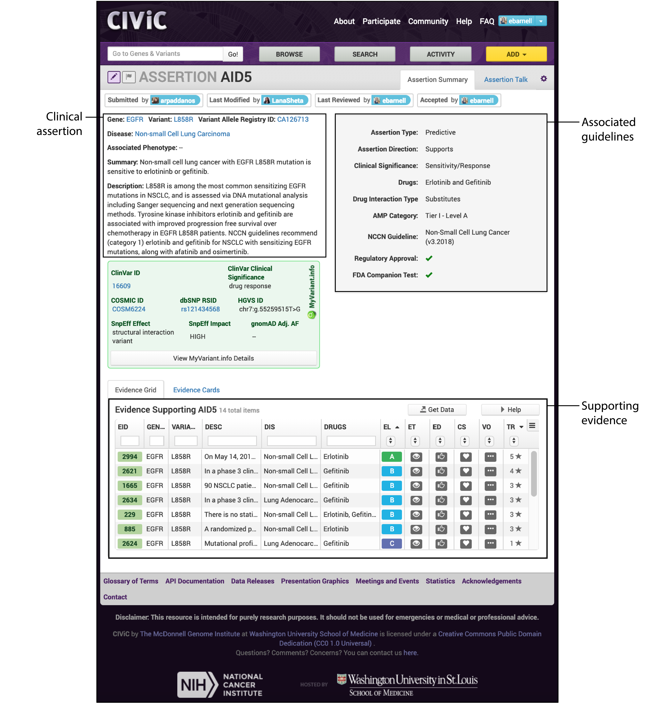
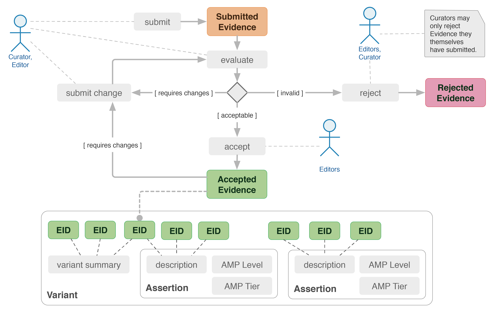

==================
CIViC introduction
==================

--------------
What is CIViC?
--------------
The `Clinical Interpretations of Variants in Cancer (CIViC) database <https://civicdb.org/>`_ is an open
access, open source, community-driven web resource that captures clinically
relevant variants in cancer. CIViC is built on evidence statements, whereby
each statement summarizes variant actionability described by a publication.
These evidence statements are summarized at the variant level and also at the
gene level. An example of this hierarchy has been provided:

.. image:: CIViC_hierarchy.png

----------------------
What is an Assertion?
----------------------

Evidence items can also be used to build `Assertions <https://civicdb.org/help/evidence/overview>`_. CIViC assertions aggregates individual evidence items into a single clinical action that allows for incorporation of guidelines and varying levels of specificity (e.g., ACMG, FDA companion tests, drug approvals, AMP variant levels, NCCN guidelines, etc.). An example of a CIViC assertion is shown below:

---------------
Getting Started
---------------
Below we have provided a screencast entitled, `CIViC - Getting Started <https://www.youtube.com/watch?v=Vr0BDUKkDeI>`_.
This screencast covers:
* Description of CIViC and its goals
* Navigating through CIViC's core pages
* Browsing, searching, and consuming knowledgebase content

TO-DO: Embed YouTube Video: https://www.youtube.com/watch?v=Vr0BDUKkDeI

---------------
CIViC Resources
---------------

We have provided a variety of resources to introduce users to the CIVIC database. Please review the following information about CIViC and the CIViC team:

- `Nature Genetics Publication <https://www.nature.com/articles/ng.3774>`_
- `CIViC Help Documents <https://civicdb.org/help/introduction>`_
- `CIViC Glossary <https://civicdb.org/glossary>`_
- `API Documentation <https://griffithlab.github.io/civic-api-docs/>`_

If you have further issues or need to report a problem, feel free to email the
CIViC team at `help@civicdb.org <help@civicdb.org>`_

---------------------
Contributing to CIViC
---------------------
Any user can browse or search existing curation within the database. However,
users must create an account and log-in to contribute to CIViC. Different types
of contributions can be found under
`Example Activities <https://civicdb.org/help/getting-started/example-activities>`_
on the CIViC help pages. These activities include:

- Adding evidence
- Contributing to variant or gene summaries
- Editing CIViC content
- Adding assertions
- Other curation tasks such as variant coordinate curation

Once a new evidence item or change to existing evidence is submitted to the CIViC database it will become visible (depending on user display preferences). However, the submission will be listed as a “submitted” or “pending” until it is accepted by an editor. CIViC editors must have attained a sufficient degree of relevant education (typically PhD or MD level), must be extensively familiar with the CIViC interface, have a demonstrated track record of successful curation within the database, and must be approved by two existing editorial members. More information on becoming an editor can be found on the
`Becoming an Editor Help Docs <https://civicdb.org/help/editor>`_. An example of how a submitted or revised evidence item becomes accepted in CIViC is shown below:

Regardless of curator status, each activity is recorded in the database.
Revision history can be viewed for all items within CIViC and personal
contributions can be viewed on an individual’s user profile. To promote user
activity, CIViC badges can be earned for various curation actions and the
`Community Leaderboards <https://civicdb.org/community/main>`_ show top
activity in CIViC parsed by activity type.

^^^^^^^^^^^^^^^^^^^^^
Adding Evidence Items
^^^^^^^^^^^^^^^^^^^^^
The main activity in CIViC surrounds adding and editing evidence statements.
Below we have provided a screencast entitled,
`Adding CIViC Evidence <https://www.youtube.com/watch?v=od5Tgdfo6Qs>`_ to walk
users through creating an evidence item in CIViC. This screencast covers:

- Scanning a publication for curatable details
- Signing into CIViC to Add Evidence
- Walking through the Add Evidence form
- Viewing the submitted evidence

TO-DO: Embed YouTube Video: https://www.youtube.com/watch?v=od5Tgdfo6Qs

More information on evidence Items can be found on the CIViC Help Pages under `Evidence <https://civicdb.org/help/evidence/overview>`_. This guide provides detailed information on evidence statement inputs including: variant origin, evidence types, evidence levels, and evidence trust ratings. Additionally, when users `add evidence items <https://civicdb.org/add/evidence/basic>`_, we provide hints and helpful prompts in the right-hand column to assist with evidence submission.

^^^^^^^^^^^^^^^^^^^^^^^^^
Editing entities in CIViC
^^^^^^^^^^^^^^^^^^^^^^^^^
Any item in the CIViC interface can be edited using the pencil icon. TO DO: insert pencil icon
Below we have provided a screencast entitled, `Editing entities in CIViC <https://www.youtube.com/watch?v=uss4R20ymPA>`_ to walk users through editing items (i.e., evidence, variants, genes or assertions)  in CIViC. This screencast covers:

- Navigating to an entity's Edit Form
- Importance of edit comments
- Identifying entities with pending changes
- Navigating to an entity's suggested changes
- Reviewing entity revisions

TO-DO: Embed YouTube Video: https://www.youtube.com/watch?v=uss4R20ymPA
