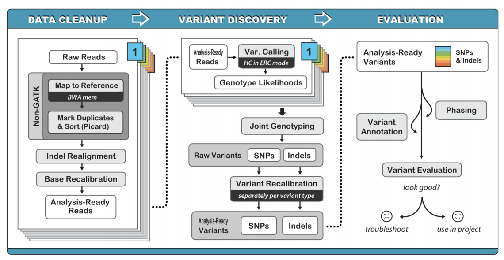

===========================
Identify somatic variants
===========================

The completion of the sequencing pipeline results in raw FASTA files, which are text-based files that represent nucleotide sequencings. In this section, we describe how to align sequencing reads to reference genome, how to call somatic variants using automated software, and how to refine variants using semi-automated processes.

This section was made possible by the wonderful information provided by the `Precision Medicine Bioinformatic Course <https://pmbio.org/>`_ developed in the `Griffith Lab <http://griffithlab.org>`_.

--------------------------------
Outputs from Sequencing Pipeline
--------------------------------

>>>>>>>>>>>>>>>
1) FASTA Format
>>>>>>>>>>>>>>>

During library preparation and target enrichment, read strands are generated as input for sequencing platforms. These read strands are digitally read by sequencing machines and printed to a `FASTA file <https://en.wikipedia.org/wiki/FASTA_format>`_. If your sequencing machine parameter included paired-end reads, whereby each read was read twice, then you will have two FASTA files per sample. These raw files have a consistent format that can be easily read by aligners. Each line a FASTA file includes a header and a sequence:

	> GAPDH_204s.100.1
	AATTAGGAGCGATTTGAGATTGCCCCCGATTTATTGACCCGTTTAGCC

	> HAPTB_204s.100.1
	AAGGCGTGAGAAAGTGCCCGTGGGTAGTGCGGGAGTGGGATGGTAGCC

Raw FASTA files will include any indexes, linkers, or unique-molecular identifiers (UMIs) that were employed in library preparation or hybridization capture. These sequences will need to be trimmed from the raw sequencing reads prior to alignment. Often this trimming process will be performed by software provided by the commercial entity associated with the instrument being used.

As FASTA files are processed, read strands in FASTA files are annotated with additional information including alignment location, quality, strand, etc. 

>>>>>>>>>>>>>>
2) FASTQ Files
>>>>>>>>>>>>>>

In addition to FASTA files, sequencing runs often produce `FASTQ files <https://en.wikipedia.org/wiki/FASTQ_format>`_, which provides a high level overview of sequencing quality. FASTQ files also have a consistent format that can be easily read by aligners. Each line a FASTQ file includes a header, a sequence, a separator, and quality scores:

	> GAPDH_204s.100.1
	AATTAGGAGCGATTTGAGATTGCCCCCGATTTATTGACCCGTTTAGCC
	+
	!``*((_*>*+())))>>>>>***+1.(%%%%%^&****#)CCCCC65

	> HAPTB_204s.100.1
	AAGGCGTGAGAAAGTGCCCGTGGGTAGTGCGGGAGTGGGATGGTAGCC
	+
	!``*(((*(*+()))>>>>>.%%%%^&**#)C65***+()))>>>>>.%

Quality scores are based on the `Phred scale <https://en.wikipedia.org/wiki/Phred_quality_score>`_ and are enclosed using `ASCII Annotation <https://en.wikipedia.org/wiki/ASCII>`_ characters (for brevity). Each score is calculated differently depending on the technology/instrument used for sequencing.

>>>>>>>>>>>>>>>>>>>>
3) Pre-Alignment QC
>>>>>>>>>>>>>>>>>>>>

FASTQ files can be used to generate FastQC Reports. These reports show basic statistics about sequencing (total reads, total poor quality reads, sequence length, GC content, etc.) and provide graphs that give the user a feel for sequencing quality. An example of this type of report is shown below:

..image:: images/FastQC_Report.png

Generating pre-alignment QC can be accomplished following the commands on the `PreAlignment QC page <https://pmbio.org/module-02-inputs/0002/06/01/PreAlignment_QC/>`_ provided by the Precision Medicine Bioinformatic Course.

---------------------
Alignment Strategies
---------------------

>>>>>>>>>>>>>>>>>>>>
The Reference Genome
>>>>>>>>>>>>>>>>>>>>

The reference genome approximates the complete representation of the human genetic sequence for the 4 billion base pairs in human DNA. Using a representative assembly prevents the need to build an assembly each time a genome is sequenced, however, there are intrinsic flaws to this approach. Specifically, due to single nucleotide polymorphisms (SNPs) intrinsic to an individual, the reference genome does not perfectly match any one individual. Further, repetitive elements (duplications, inverted repeats, tandem repeats), the reference is often incomplete or incorrect. Therefore, new genome assemblies are constantly being built to improve our ability to resolve the true human genome sequence. Most recently, GRCh37 was published in 2009 and GRCh38 was published in 2013. A `summary of genome releases <http://genome.ucsc.edu/FAQ/FAQreleases.html>`_ has been provided by UCSC.

Currently, the CIViC database supports variants from NCBI36 (hg18), GRCh37 (hg19), and GTCh38 (hg20), however most variants are associated with reference build GRCh37 (hg19). Therefore, we recommend that for the pipeline, the alignment strategy should use GRCh37 (hg19).

>>>>>>>>>>>>>>>>>>>>
Alignment Algorithms
>>>>>>>>>>>>>>>>>>>>

Alignment can be performed using various alignment software. Generally speaking, alignment strategies can either optimize accuracy or processing time.

	- Optimal solutions include either Spith-Waterman or Needleman-Wunsch alignment strategies. These algorithms are computationally expensive and process read strands slowly.

	- Fast solutions include hash-based solutions such as Burrows-Wheeler transformation. These algorithms create shortcuts to reduce alignment time.

The input for alignment software is the FASTA files and the output from alignment is a `Sequence Alignment Map (SAM) <http://samtools.github.io/hts-specs/SAMv1.pdf>`_ or `Binary Alignment Map (BAM). Typically, these software also produce alignment QC, which includes information about mapped reads, coverage, etc.

Sequencing alignment can be accomplished following the commands on the `Alignment page <https://pmbio.org/module-03-align/0003/02/01/Alignment/>`_ provided by the Precision Medicine Bioinformatic Course.

-------------------------
Germline Variant Analysis
-------------------------

The next step in the sequencing pipeline is to use paired tumor and normal alignments for germline and somatic variant calling. Germline variant calling consists of identifying single nucleotide polymorphisms (SNPs), insertions/deletions (indels), and structural variants (SVs) that are intrinsic to the normal tissue. Somatic variant calling is a similar process, but it requires the variant to be exclusively observed in the tumor tissue and not present in the germline (normal) tissue. Below we describe automated methods for bother germline and somatic variant calling.

>>>>>>>>>>>>>>>>>>>>>>>>>>
Germline Variant Analysis
>>>>>>>>>>>>>>>>>>>>>>>>>>

Germline variant calling can be performed using a variety of software. Typically, our lab uses `GATK (genome analysis tool kit) <https://software.broadinstitute.org/gatk/>`_ for initial germline calling and variant filtering.

The optimal method for germline variant calling using `GATK Haplotype Caller <https://software.broadinstitute.org/gatk/documentation/tooldocs/3.8-0/org_broadinstitute_gatk_tools_walkers_haplotypecaller_HaplotypeCaller.php>`_, which considers all SNPs, Indels, and SVs together by creating a local de novo assembly. Although this method is computationally intensive, it improves overall variant calling accuracy by eliminating many false positives.

Germline variant calling can be accomplished following the commands on the `Germline SNV and Indel Calling page <https://pmbio.org/module-04-germline/0004/02/01/Germline_SnvIndel_Calling/>`_ provided by the Precision Medicine Bioinformatic Course.

>>>>>>>>>>>>>>>>>>>>>>>>>>>>
Germline Variant Refinement
>>>>>>>>>>>>>>>>>>>>>>>>>>>>

Germline variant refinement can be performed by using heuristic cutoffs for quality metrics or by employing Variant Quality Score Recalibration (VQSR). Hard filtering uses (somewhat arbitrary) cutoffs for quality scores that are provided by the GATK workflow. For example, you can require a minimum QualByDepth (QD) of 2.0. GATK provides strategies for hard filtering in their `Hard Filtering Tutorial <https://software.broadinstitute.org/gatk/documentation/article?id=2806>`_. VQSR filtering is more sophisticated than hard-filtering. This model estimates the probability that a variant is real and allows filtering at various confidence levels. GATK provides methods for recalibrating variant quality scores in their `VQSR Tutorial <https://software.broadinstitute.org/gatk/documentation/article?id=2805>`_.

Germline variant filtering can be accomplished following the commands on the `Germline Filtering, Annotation, and Review module <https://pmbio.org/module-04-germline/0004/02/02/Germline_SnvIndel_FilteringAnnotationReview/>`_ provided by the Precision Medicine Bioinformatic Course.

>>>>>>>>>>>>>>>>>>>>>>>>>>
Somatic Variant Analysis
>>>>>>>>>>>>>>>>>>>>>>>>>>

In addition to germline variant calling, somatic variant calling can be performed identifying differences that are intrinsic to the tumor sample and not observed in the matched normal samples. Somatic variant calling requires looking for single nucleotide variants (SNVs), insertions and deletions (indels), copy number variants (CNVs), structural variants (SVs), and loss of heterozygosity (LOH). These different types of variants can be identified by using various software including: Pindel, VarScan, Mutect, Strelka, or a combination of multiple variant callers. Additionally, somatic variants can be further confirmed by comparing identified variants to variant databases such as:
	- `gnomAD <https://gnomad.broadinstitute.org/>`_: (123,136 WXS and 15,496 WGS) 
	- `1000 genome <http://www.internationalgenome.org/>`_: 1000 genome projects
	- `Exome Aggregation Consortium <http://exac.broadinstitute.org/>`_: (~60,000 individuals)
	- `Exome sequencing project <https://esp.gs.washington.edu/drupal/>`_: (~6,500 individuals)

>>>>>>>>>>>>>>>>>>>>>>>>>>>
Somatic Variant Refinement
>>>>>>>>>>>>>>>>>>>>>>>>>>>

Following automated somatic variant calling, somatic variant refinement is required to identify a high-quality list of variants associated with an individual's tumor. Somatic variant refinement requires either employing an algorithm on the sequencing data to further filter sequencing artifacts or visualizing aligned reads in a genomic viewer and manually refining variants using common sequencing tags. Both of these methods for somatic variant refinement have been described:

	1) DeepSVR: A deep learning approach to automate refinement of somatic variant calling from cancer sequencing data
 
	Ainscough, B.J., Barnell E.K., Griffith, M., Rohan, T.E., Govindan, R., Mardis, E.R., Swamidass. J.S., Griffith O.L. Deep Learning Approach to Automating Somatic Variant Refinement. Nature Genetics, 2018 [Epub ahead of print]. (https://doi.org/10.1038/s41588-018-0257-y)

	2) Manual Review: Standard operating procedure for somatic variant refinement of sequencing data with paired tumor and normal samples

	Barnell E.K., Ronning P., Campbell K.M., Krysiak K., Ainscough B.J., Sheta L.M., Pema S.P., Schmidt A.D., Richters M., Cotto K.C., Danos A.M., Ramirez C., Skidmore Z.L., Spies N.C., Hundal J., Sediqzad M.S., Kunisaki J., Gomez F., Trani L., Matlock M., Wagner A.H., Swamidass S.J., Griffith M., Griffith O.L. Standard operating procedure for somatic variant refinement of sequencing data with paired tumor normal samples. Genetics in Medicine, October 5, 2018 [Epub ahead of print]. (https://doi.org/10.1038/s41436-018-0278-z)

After employing somatic variant refinement strategies on the somatic variant list, the final list of putative somatic variants can be used 
	

