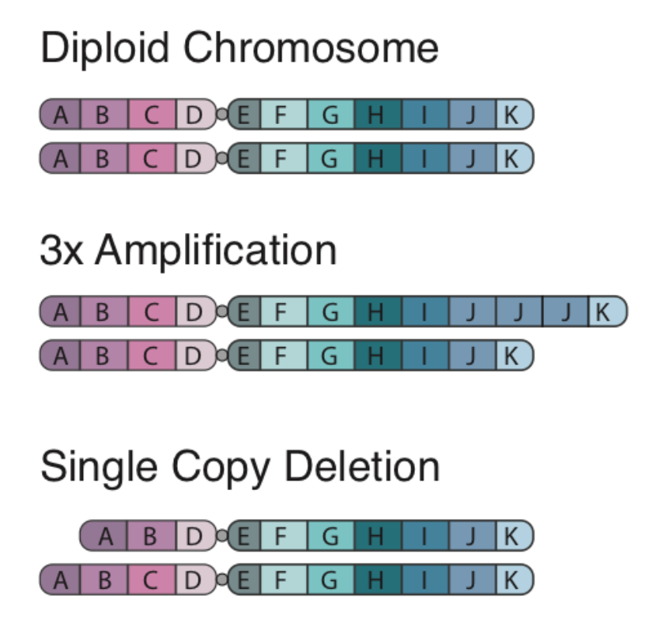

.. image:: images/Identify.png

===========================
Identify somatic variants
===========================

The completion of the sequencing pipeline results in raw FASTA files, which are text-based files that represent nucleotide sequencings. In this section, we describe how to align sequencing reads to reference genome, how to call somatic variants using automated software, and how to refine variants using semi-automated processes.

This section was made possible by the wonderful information provided by the `Precision Medicine Bioinformatic Course <https://pmbio.org/>`_ developed in the `Griffith Lab <http://griffithlab.org>`_.

--------------------------------
Outputs from Sequencing Pipeline
--------------------------------

>>>>>>>>>>>>>>>
1) FASTA Format
>>>>>>>>>>>>>>>

During library preparation and target enrichment, read strands are generated as input for sequencing platforms. These read strands are digitally read by sequencing machines and printed to a `FASTA file <https://en.wikipedia.org/wiki/FASTA_format>`_. If your sequencing machine parameter included paired-end reads, whereby each read was read twice, then you will have two FASTA files per sample. These raw files have a consistent format that can be easily read by aligners. Each line a FASTA file includes a header and a sequence:

	> GAPDH_204s.100.1
	AATTAGGAGCGATTTGAGATTGCCCCCGATTTATTGACCCGTTTAGCC

	> HAPTB_204s.100.1
	AAGGCGTGAGAAAGTGCCCGTGGGTAGTGCGGGAGTGGGATGGTAGCC

Raw FASTA files will include any indexes, linkers, or unique-molecular identifiers (UMIs) that were employed in library preparation or hybridization capture. These sequences will need to be trimmed from the raw sequencing reads prior to alignment. Often this trimming process will be performed by software provided by the commercial entity associated with the instrument being used.

As FASTA files are processed, read strands in FASTA files are annotated with additional information including alignment location, quality, strand, etc. 

>>>>>>>>>>>>>>
2) FASTQ Files
>>>>>>>>>>>>>>

In addition to FASTA files, sequencing runs often produce `FASTQ files <https://en.wikipedia.org/wiki/FASTQ_format>`_, which provides a high level overview of sequencing quality. FASTQ files also have a consistent format that can be easily read by aligners. Each line a FASTQ file includes a header, a sequence, a separator, and quality scores:

	> GAPDH_204s.100.1
	AATTAGGAGCGATTTGAGATTGCCCCCGATTTATTGACCCGTTTAGCC
	+
	!``*((_*>*+())))>>>>>***+1.(%%%%%^&****#)CCCCC65

	> HAPTB_204s.100.1
	AAGGCGTGAGAAAGTGCCCGTGGGTAGTGCGGGAGTGGGATGGTAGCC
	+
	!``*(((*(*+()))>>>>>.%%%%^&**#)C65***+()))>>>>>.%

Quality scores are based on the `Phred scale <https://en.wikipedia.org/wiki/Phred_quality_score>`_ and are enclosed using `ASCII Annotation <https://en.wikipedia.org/wiki/ASCII>`_ characters (for brevity). Each score is calculated differently depending on the technology/instrument used for sequencing.

>>>>>>>>>>>>>>>>>>>>
3) Pre-Alignment QC
>>>>>>>>>>>>>>>>>>>>

FASTQ files can be used to generate FastQC Reports. These reports show basic statistics about sequencing (total reads, total poor quality reads, sequence length, GC content, etc.) and provide graphs that give the user a feel for sequencing quality. An example of this type of report is shown below:

..image:: images/FastQC_Report.png

Generating pre-alignment QC can be accomplished following the commands on the `PreAlignment QC page <https://pmbio.org/module-02-inputs/0002/06/01/PreAlignment_QC/>`_ provided by the Precision Medicine Bioinformatic Course.

---------------------
Alignment Strategies
---------------------

>>>>>>>>>>>>>>>>>>>>
The Reference Genome
>>>>>>>>>>>>>>>>>>>>

The reference genome approximates the complete representation of the human genetic sequence for the 4 billion base pairs in human DNA. Using a representative assembly prevents the need to build an assembly each time a genome is sequenced, however, there are intrinsic flaws to this approach. Specifically, due to single nucleotide polymorphisms (SNPs) intrinsic to an individual, the reference genome does not perfectly match any one individual. Further, repetitive elements (duplications, inverted repeats, tandem repeats), the reference is often incomplete or incorrect. Therefore, new genome assemblies are constantly being built to improve our ability to resolve the true human genome sequence. Most recently, GRCh37 was published in 2009 and GRCh38 was published in 2013. A `summary of genome releases <http://genome.ucsc.edu/FAQ/FAQreleases.html>`_ has been provided by UCSC.

Currently, the CIViC database supports variants from NCBI36 (hg18), GRCh37 (hg19), and GTCh38 (hg20), however most variants are associated with reference build GRCh37 (hg19). Therefore, we recommend that for the pipeline, the alignment strategy should use GRCh37 (hg19).

>>>>>>>>>>>>>>>>>>>>
Alignment Algorithms
>>>>>>>>>>>>>>>>>>>>

Alignment can be performed using various alignment software. Generally speaking, alignment strategies can either optimize accuracy or processing time.

	- Optimal solutions include either Spith-Waterman or Needleman-Wunsch alignment strategies. These algorithms are computationally expensive and process read strands slowly.

	- Fast solutions include hash-based solutions such as Burrows-Wheeler transformation. These algorithms create shortcuts to reduce alignment time.

The input for alignment software is the FASTA files and the output from alignment is a `Sequence Alignment Map (SAM) <http://samtools.github.io/hts-specs/SAMv1.pdf>`_ or `Binary Alignment Map (BAM). Typically, these software also produce alignment QC, which includes information about mapped reads, coverage, etc.

Sequencing alignment can be accomplished following the commands on the `Alignment page <https://pmbio.org/module-03-align/0003/02/01/Alignment/>`_ provided by the Precision Medicine Bioinformatic Course.

-------------------------
Germline Variant Analysis
-------------------------

The next step in the sequencing pipeline is to use paired tumor and normal alignments for germline and somatic variant calling. Germline variant calling consists of identifying single nucleotide polymorphisms (SNPs), insertions/deletions (indels), and structural variants (SVs) that are intrinsic to the normal tissue. Somatic variant calling is a similar process, but it requires the variant to be exclusively observed in the tumor tissue and not present in the germline (normal) tissue. Below we describe automated methods for bother germline and somatic variant calling.

>>>>>>>>>>>>>>>>>>>>>>>>>>
Germline Variant Analysis
>>>>>>>>>>>>>>>>>>>>>>>>>>

Germline variant calling can be performed using a variety of software. Typically, our lab uses `GATK (genome analysis tool kit) <https://software.broadinstitute.org/gatk/>`_ for initial germline calling and variant filtering.

.. image:: images/Germline_workflow.png

The optimal method for germline variant calling using `GATK Haplotype Caller <https://software.broadinstitute.org/gatk/documentation/tooldocs/3.8-0/org_broadinstitute_gatk_tools_walkers_haplotypecaller_HaplotypeCaller.php>`_, which considers all SNPs, Indels, and SVs together by creating a local de novo assembly. Although this method is computationally intensive, it improves overall variant calling accuracy by eliminating many false positives.

Germline variant calling can be accomplished following the commands on the `Germline SNV and Indel Calling page <https://pmbio.org/module-04-germline/0004/02/01/Germline_SnvIndel_Calling/>`_ provided by the Precision Medicine Bioinformatic Course.

>>>>>>>>>>>>>>>>>>>>>>>>>>>>
Germline Variant Refinement
>>>>>>>>>>>>>>>>>>>>>>>>>>>>

Germline variant refinement can be performed by using heuristic cutoffs for quality metrics or by employing Variant Quality Score Recalibration (VQSR). Hard filtering uses (somewhat arbitrary) cutoffs for quality scores that are provided by the GATK workflow. For example, you can require a minimum QualByDepth (QD) of 2.0. GATK provides strategies for hard filtering in their `Hard Filtering Tutorial <https://software.broadinstitute.org/gatk/documentation/article?id=2806>`_. VQSR filtering is more sophisticated than hard-filtering. This model estimates the probability that a variant is real and allows filtering at various confidence levels. GATK provides methods for recalibrating variant quality scores in their `VQSR Tutorial <https://software.broadinstitute.org/gatk/documentation/article?id=2805>`_.

Germline variant filtering can be accomplished following the commands on the `Germline Filtering, Annotation, and Review module <https://pmbio.org/module-04-germline/0004/02/02/Germline_SnvIndel_FilteringAnnotationReview/>`_ provided by the Precision Medicine Bioinformatic Course.

-------------------------
Somatic Variant Analysis
-------------------------

In addition to germline variant calling, somatic variant calling can be performed identifying differences that are intrinsic to the tumor sample and not observed in the matched normal samples. Somatic variant calling requires looking for single nucleotide variants (SNVs), insertions and deletions (indels), copy number variants (CNVs), structural variants (SVs), and loss of heterozygosity (LOH). These different types of variants can be identified by using various software. Here we will go through each of these automated variant callers to describe the types of variants each caller can identify and subsequent strengths and weaknesses.

>>>>>>>>>>>>>>>>>>>>>>>>>
Somatic SNV/InDel Calling
>>>>>>>>>>>>>>>>>>>>>>>>>

Algorithms that perform Somatic SNV/Indel Calling include: VarScan, Strelka, and MuTect. It is recommended that aligned bam files are evaluated by multiple different variant callers and subsequently, filtering can be employed by identifying variants that were observed by multiple different callers.

	1) `Varscan <http://varscan.sourceforge.net/>`_ is a platform-independent mutation caller for targeted, exome, and whole-genome resequencing data and employs a robust heuristic/statistic approach to call variants that meet desired thresholds for read depth, base quality, variant allele frequency, and statistical significance.

	2) `Strelka <https://github.com/Illumina/strelka/blob/master/docs/userGuide/README.md>`_ calls germline and somatic small variants from mapped sequencing reads and is optimized for rapid clinical analysis of germline variation in small cohorts and somatic variation in tumor/normal sample pairs. Both germline and somatic callers include a final empirical variant rescoring step using a random forest model to reflect numerous features indicative of call reliability which may not be represented in the core variant calling probability model.

	3) `MuTect2 <https://software.broadinstitute.org/gatk/documentation/tooldocs/3.8-0/org_broadinstitute_gatk_tools_walkers_cancer_m2_MuTect2.php>`_ is a somatic SNP and indel caller that combines the DREAM challenge-winning somatic genotyping engine of the original MuTect (Cibulskis et al., 2013) with the assembly-based machinery of HaplotypeCaller.

Somatic Variant Calling with these three automated callers can be accomplished following the commands on the `Somatic SNV/InDel Calling module <https://pmbio.org/module-05-somatic/0005/02/01/Somatic_SnvIndel_Calling/>`_ provided by the Precision Medicine Bioinformatic Course.

>>>>>>>>>>>>>>>>>>>
Somatic SV Calling
>>>>>>>>>>>>>>>>>>>

`Manta <https://github.com/Illumina/manta>`_ is a structural variant caller maintained by Illumina and optimized for calling somatic variation in tumor/normal pairs. Structural variants are rearrangements in DNA involving a breakpoint(s). Generally speaking structural variants can fall into four categories:

	1) Insertions: a region is inserted into the DNA
	2) Deletions: a region is deleted in the DNA
	3) Inversions: a section of DNA is reversed
	4) Translocations: a section of DNA is remved and re-inserted in a new region

Somatic Structural Variant calling with Manta can be executed by following the commands on the `Somatic SV Calling module <https://pmbio.org/module-05-somatic/0005/03/01/Somatic_SV_Calling/>`_ provided by the Precision Medicine Bioinformatic Course.

>>>>>>>>>>>>>>>>>>>>
Somatic CNV Calling
>>>>>>>>>>>>>>>>>>>>

Copy number alterations occur when a section of the genome is duplicated or deleted. This phenomenon has an important role in evolution for development of homologs/paralogs that allow for development of new function with retention of old function (e.g., alpha and beta hemoglobin). However, these events can also play an intrinsic role in disease development. Examples of Copy Number Alterations are shown below:

There are two algorithms that can be used to identify copy number alterations in tumor samples:

	1) `copyCat <https://github.com/chrisamiller/copyCat>`_ is an R package used for detecting somatic (experiment/control) copy number aberrations. It works by measuring the depth of coverage from a sequencing experiment. For example in a diploid organism such as human, a single copy number deletion should result in aproximately half the depth (number of reads) compared to the control.
	2) `CNVkit <https://github.com/etal/cnvkit>`_ is a python package for copy number calling specifically designed for hybrid capture and exome sequencing data. During a typical hybrid capture sequencing experiment the probes capture DNA from the sequencing library, however the probes don’t always bind perfectly. This results in not only the “on-target” regions being pulled from the library for later sequencing but “off-target” as well where the probes didn’t perfectly bind and essentially pulled the wrong region. The effect provides very low read coverage across the entire genome which CNVkit takes advantage of to make CN calls. 

Copy Number Variant calling with copyCat and CNVkit can be executed by following the commands on the `CNV Calling module <https://pmbio.org/module-05-somatic/0005/04/01/Somatic_CNV_Calling/>`_ provided by the Precision Medicine Bioinformatic Course.

>>>>>>>>>>>>>>>>>>>>
Somatic LOH Calling
>>>>>>>>>>>>>>>>>>>>

Loss of heterozygosity is a common genetic event that occurs in cancer whereby one allele is lost. In this segment, the tumor sample appears to be homozygous whereas the same section is heterozygous in the matched normal sample. Methods for calculating sections of LOH requires first calculating the variant allele frequencies (VAFs) in the normal sample to find heterozygous germline positions. Subsequently, we run `bam-readcounts <https://github.com/genome/bam-readcount>`_ on the tumor sample at these same genomic loci and determine if the tumor sample shows homo- or heterozygosity. If there is an area of homozygosity in the tumor sample that is heterozygous in the normal sample, this represents a section of LOH.

Methods for identifying and visualizing section of LOH can be found in the `Somatic LOH Calling module <https://pmbio.org/module-05-somatic/0005/05/01/Somatic_LOH_Calling/>`_ provided by the Precision Medicine Bioinformatic Course.

>>>>>>>>>>>>>>>>>>>>>>>>>>>
Somatic Variant Refinement
>>>>>>>>>>>>>>>>>>>>>>>>>>>

Following automated somatic variant calling, somatic variant refinement is required to identify a high-quality list of variants associated with an individual's tumor. Especially for SNVs/Indels, we recommend that the final list of variants identified by automated callers is further refined. This can be accomplished by executing one or all of the following:

	1) Heuristic filtering based on variant allele frequency (VAF), total coverage, allele read count, or and allele read depth. We recommend that variants require at least 20X coverage in both the tumor and normal sample with a VAF >5%. These numbers can be adjusted based on the experiment and the reagents employed on the samples. 

	2) Manual review of aligned sequencing reads. The Griffith Lab has defined a `Standard Operating Procedure (SOP) <https://www.nature.com/articles/s41436-018-0278-z>`_ for somatic variant refinement of sequencing data with paired tumor and normal sample. The SOP describes a standard way to visualize reads using Integrative Genomic Viewer (IGV) and assign labels to variants to filter in true somatic variants and filter out variants attributable to sequencing and alignment artifacts. Although manual review of aligned sequencing reads is incredible effective in eliminating many false positives observed during automated calling, it is incredibly time-consuming and expensive.

	3) Automated refinement using a machine learning approach. `DeepSVR <https://github.com/griffithlab/DeepSVR/wiki>`_ is a deep learning model that evaluates variants called by automated callers and provides a value between 0-1 that indicates confidence in that variant being a true positive. The input in the model is 59 features derived from aligned BAM files and the output is a value for three labels: Somatic, Ambiguous, Fail. This model can be employed on samples to further refine a list of somatic variants from automated callers.

Additionally, somatic variants can be further confirmed by comparing identified variants to variant databases such as:

	- `gnomAD <https://gnomad.broadinstitute.org/>`_: (123,136 WXS and 15,496 WGS) 
	- `1000 genome <http://www.internationalgenome.org/>`_: 1000 genome projects
	- `Exome Aggregation Consortium <http://exac.broadinstitute.org/>`_: (~60,000 individuals)
	- `Exome sequencing project <https://esp.gs.washington.edu/drupal/>`_: (~6,500 individuals)

Methods for Somatic Variant Refinement can be viewed on the `Somatic SNV and Indel Manual Review module <https://pmbio.org/module-05-somatic/0005/02/03/Somatic_SNV_and_Indel_Manual_Review/>`_ provided by the Precision Medicine Bioinformatic Course.
