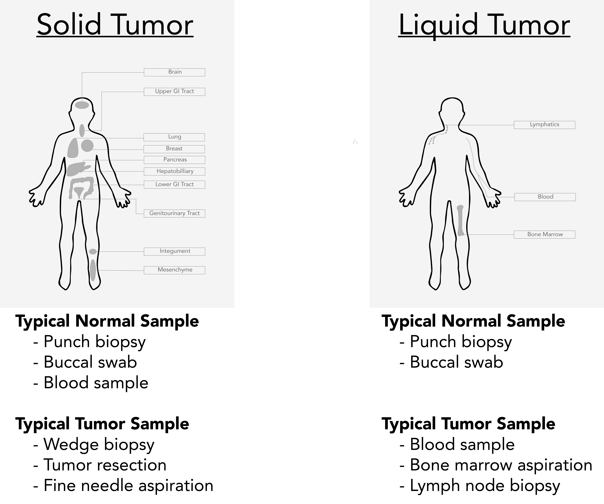

.. image:: Sequence.png

==============================
Methods for sequencing samples
==============================

------------------
Sample procurement
------------------

For the analysis described here, samples must be derived from a germline tissue (normal sample) and a diseased tissue (tumor sample). Procuring samples from these two sample types requires consideration of the malignancy:

- **Liquid Cancers**: A cancer that begins in blood-forming tissue, such as the bone marrow, or in the cells of the immune system (e.g., leukemia, multiple myeloma, and some lymphomas)

- **Solid Cancers**: An abnormal mass that does not contain cysts or liquid areas (e.g., sarcomas, carcinomas, and some lymphomas)

----------------------
Nucleic acid generation
----------------------

-------------------
Library preparation
-------------------

---------------------
Hybridization capture
---------------------

--------------------------
High throughput sequencing
--------------------------
